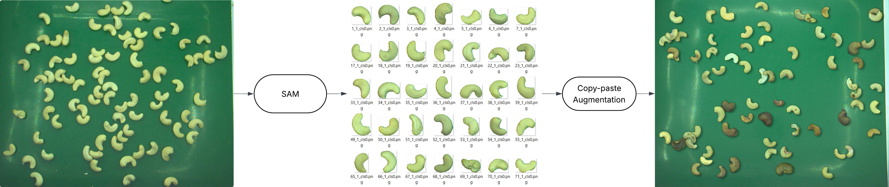
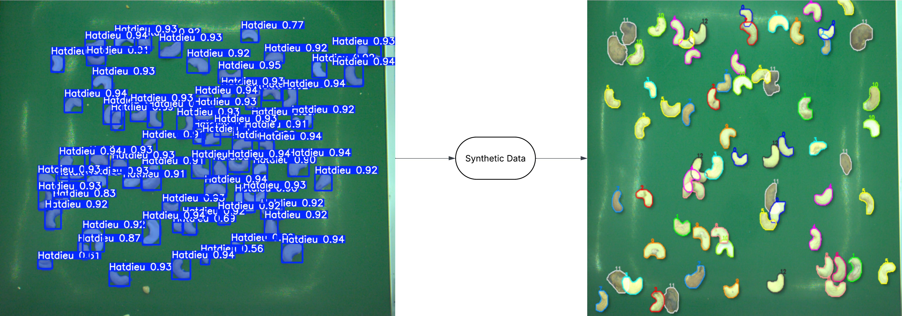

# Copy-Paste Augmentation for Cashew Nut Dataset

A project for generating synthetic data and augmentation for the cashew nut problem using the copy-paste method. The project aims to create a pipeline for augmenting cashew nut data in an industrial environment. It reduces human effort in classifying and labeling a data image combined from 13 types.

## Flow pipeline

<p align="center">
  
</p>

<p align="center">
  
</p>

<p align="center">
  <em>Pipeline: Copy-paste creates synthetic data as combined images of 13 types of cashew nuts from images of individual cashew nut types.</em>
</p>

## Environment setup

Requirements:

- Python 3.10+
- Git

Create a virtual environment on Windows PowerShell:

```powershell
python -m venv .venv
.venv\Scripts\Activate.ps1
python -m pip install --upgrade pip
pip install -r requirements.txt
```

Create a virtual environment on macOS/Linux:

```bash
python3 -m venv .venv
source .venv/bin/activate
python -m pip install --upgrade pip
pip install -r requirements.txt
```

If running with GPU/CUDA, you should install the `torch` and `torchvision` builds that match your machine before installing all dependencies.

## Folder structure

```text
Hatdieu/
|-- src/
|   |-- pred_labels.py
|   |-- mix.py
|   |-- check_labels.py
|   |-- augment.py
|   `-- count_obj_per_class.py
|-- background/
|-- data_hatdieu/
|-- model/
|-- yaml/
|-- pred_labels/        # generated after the object extraction step
|-- mix_data/           # generated after the copy-paste step
|-- data_augment/       # generated after the augment step
|-- requirements.txt
`-- README.md
```

### Meaning of the main folders

- `src/`: contains all source code for the data generation pipeline.
- `background/`: contains background images used for pasting objects.
- `data_hatdieu/`: source image data by class used for a full run.
- `model/`: contains YOLO segmentation weights and the SAM checkpoint.
- `yaml/`: contains dataset configuration and YOLO training configuration.
- `pred_labels/`: output folder of the object extraction step, including `predict/`, `labels/`, and `object/`.
- `mix_data/`: output folder of the copy-paste step, including `images/` and `labels/`.
- `data_augment/`: output folder of the additional augmentation step.

## How to run

Recommended run order:

1. Extract objects and generate intermediate labels from source images:

```powershell
python src/pred_labels.py
```

2. Create synthetic images using copy-paste:

```powershell
python src/mix.py
```

The script will open an OpenCV window to select an ROI on the background image. Press `Enter` to confirm the selected region, and press `Esc` to clear the ROI and select again.

3. Quickly check the labels of mixed images:

```powershell
python src/check_labels.py
```

4. Further augment the generated dataset:

```powershell
python src/augment.py
```

5. Count the number of objects per class:

```powershell
python src/count_obj_per_class.py
```

## Important configuration

### 1. Dataset and output paths

- File: `src/config.py`
- Important variables:
  - `DATA_HATDIEU_DIR` -> input original image folder.
  - `PRED_LABELS_DIR` -> output folder of the object extraction step.
  - `MIX_DATA_DIR` -> output folder of the copy-paste step.
  - `DATA_AUGMENT_DIR` -> output folder of the augment step.

### 2. Object extraction and label generation configuration

- File: `src/pred_labels.py`
- Important variables:
  - `MODEL`, `SAM` -> YOLO/SAM checkpoint paths.
  - `CONFIDENT` -> confidence threshold for YOLO.
  - `DEVICE` -> `auto`, `cpu`, `cuda:0`, ...
  - `BLUR`, `CLOSE`, `OPEN`, `FILL_HOLES`, `WATERSHED` -> enable/disable mask post-processing steps.
  - `MIN_AREA_RATIO` -> filter out objects that are too small.

### 3. Synthetic data generation configuration

- File: `src/mix.py`
- Important variables:
  - `N_MIX_IMG` -> number of synthetic images to create.
  - `IOU` -> overlap threshold between objects.
  - `NUM_OBJECT` -> number of objects on each mixed image.
  - `RESIZE`, `RANDOM_FLIP`, `RANDOM_ROTATE` -> enable/disable object transformations before pasting.
  - `SHADOW_MODE`, `X_LIGHT`, `Y_LIGHT`, `BASE_*`, `CAST_*` -> adjust object shadows.

### 4. Quick label-checking configuration

- File: `src/check_labels.py`
- Important variables:
  - `CHECK_IMAGES_DIR`, `CHECK_LABELS_DIR` -> image/label folders to QC.
  - `N_SAMPLES` -> number of random images used for QC.
  - `DISPLAY_SIZE` -> display window size.
  - `MODE` -> select the class to display; `-1` displays all.

### 5. Data augmentation configuration

- File: `src/augment.py`
- Important variables:
  - `SCALE_DATASET` -> number of augmented versions generated from each original image.
  - `GEOMETRIC` -> enable/disable geometric transformations.
  - `PHOTOMETRIC` -> enable/disable lighting and noise transformations.
  - `PROBABILITY` -> probability of applying each augmentation operation.
  - `PARAMS` -> amplitude parameters for each augmentation operation.
